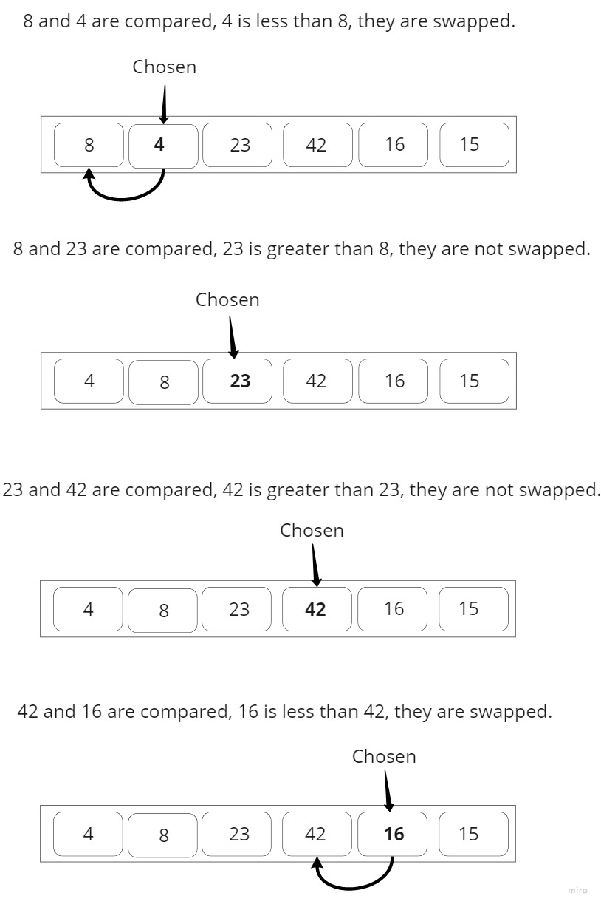
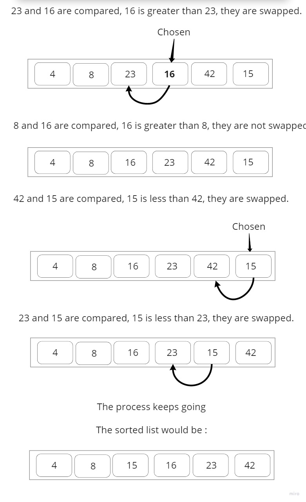

# Insertion  Sort
A simple sorting algorithm that builds sorted list by checking one item at a time. It is not that efficient in terms of large lists than more advanced algorithms such as quicksort, heapsort.
## Problem Domain:

Write a function that implements the Insertion sort algorithm.

    Input => list
    0utput => Sorted list.

## Pseudocode
 InsertionSort(int[] arr)

    FOR i = 1 to arr.length

      int j <-- i - 1
      int temp <-- arr[i]

      WHILE j >= 0 AND temp < arr[j]
        arr[j + 1] <-- arr[j]
        j <-- j - 1

      arr[j + 1] <-- temp
## Algorithm

    1- Iterate from list[1] to list[n].
    2- Compare the current element (or chosen element) to its predecessor.
    3- If the chosen element is smaller than its predecessor, swap between them.
    4- Function will Move the greater elements up and make space for the swapped element until all the list elements are done.

## Trace (Visual):

Trace this list: [8,4,23,42,16,15]

