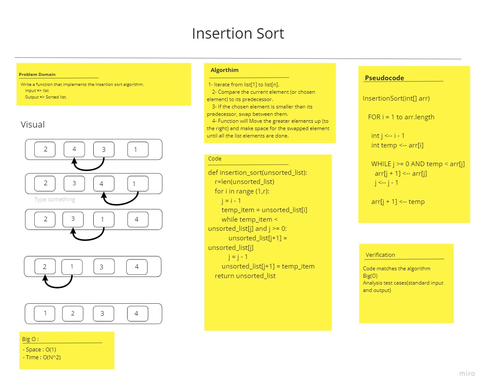

# Challenge Summary
<!-- Description of the challenge -->
Write a function that implements the Insertion sort algorithm, return a sorted list.
## Whiteboard Process
<!-- Embedded whiteboard image -->

## Approach & Efficiency
<!-- What approach did you take? Why? What is the Big O space/time for this approach? -->
- Space : O(1)
- Time : O(N^2)
## Solution:
<!-- Show how to run your code, and examples of it in action -->
    def insertion_sort(unsorted_list):
        r=len(unsorted_list)
        for i in range (1,r):
            j = i - 1
            temp_item = unsorted_list[i]
            while temp_item < unsorted_list[j] and j >= 0:
                unsorted_list[j+1] = unsorted_list[j]
                j = j - 1
            unsorted_list[j+1] = temp_item
        return unsorted_list

Unit Testing:
- [Unit tests](test_insertion_sort.py)
