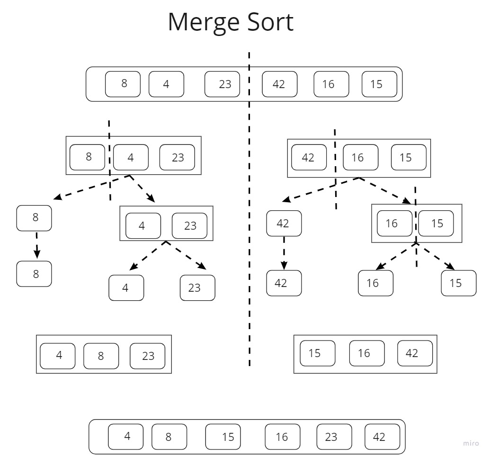

# Merge Sort
Divide and Conquer algorithm.
It divides the input list into two halves, calls itself for the two halves, and then merges the two sorted halves.

## Problem Domain:
Write a function take a unsorted list and return sorted list by implementing marge sort algorithm

    Input => list
    0utput => Sorted list.

## Pseudocode
ALGORITHM Mergesort(arr)
    DECLARE n <-- arr.length

    if n > 1
      DECLARE mid <-- n/2
      DECLARE left <-- arr[0...mid]
      DECLARE right <-- arr[mid...n]
      // sort the left side
      Mergesort(left)
      // sort the right side
      Mergesort(right)
      // merge the sorted left and right sides together
      Merge(left, right, arr)

ALGORITHM Merge(left, right, arr)
    DECLARE i <-- 0
    DECLARE j <-- 0
    DECLARE k <-- 0

    while i < left.length && j < right.length
        if left[i] <= right[j]
            arr[k] <-- left[i]
            i <-- i + 1
        else
            arr[k] <-- right[j]
            j <-- j + 1

        k <-- k + 1

    if i = left.length
       set remaining entries in arr to remaining values in right
    else
       set remaining entries in arr to remaining values in left
## Algorithm (Ascending order)

    Find the middle point of the list to divide it into two halves.

    Call mergeSort for first half

    Call mergeSort for second half.

    Merge the two halves sorted in step 2 and 3 using merge_sort function

## Trace (Visual):

Trace this list: [8,4,23,42,16,15]

