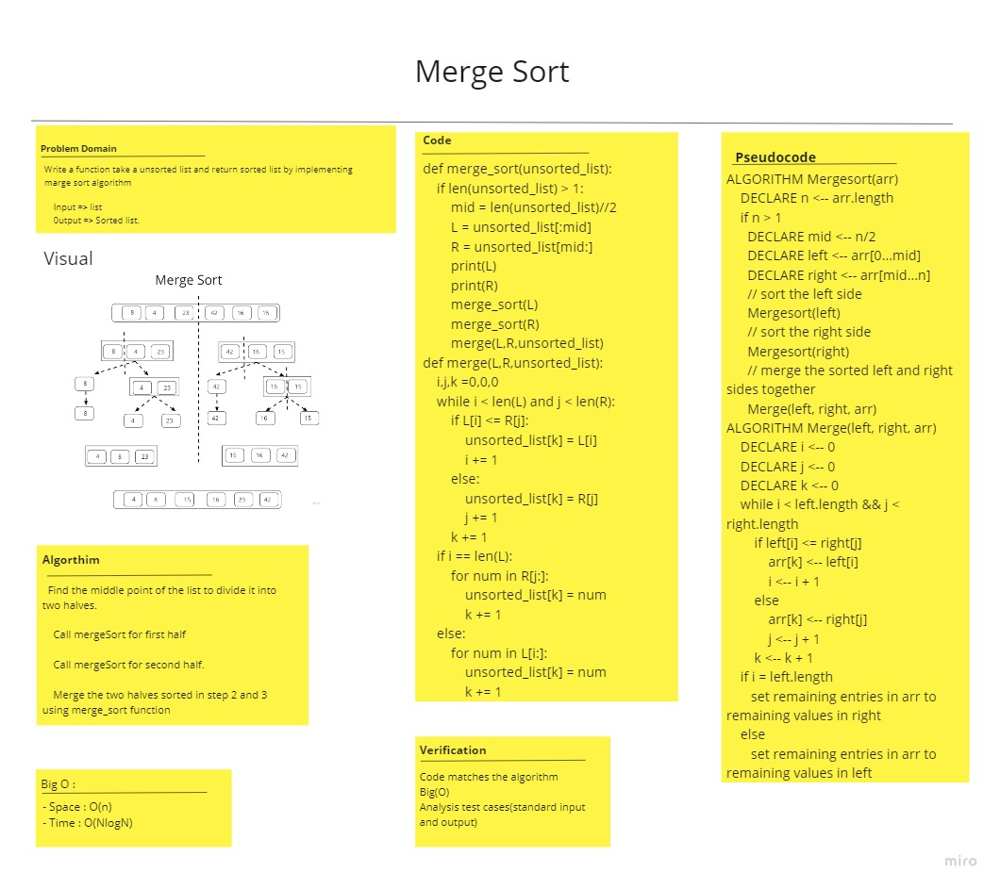

# Challenge Summary
<!-- Description of the challenge -->
Write a function take a unsorted list and return sorted list by implementing marge sort algorithm
## Whiteboard Process
<!-- Embedded whiteboard image -->

## Approach & Efficiency
<!-- What approach did you take? Why? What is the Big O space/time for this approach? -->
Space : O(n)
Time : O(nlogn)
## Solution
<!-- Show how to run your code, and examples of it in action -->
    def merge_sort(unsorted_list):

    if len(unsorted_list) > 1:
        mid = len(unsorted_list)//2
        L = unsorted_list[:mid]
        R = unsorted_list[mid:]
        merge_sort(L)
        merge_sort(R)
        merge(L,R,unsorted_list)

        def merge(L,R,unsorted_list):
            i,j,k =0,0,0
            while i < len(L) and j < len(R):
                if L[i] <= R[j]:
                    unsorted_list[k] = L[i]
                    i += 1
                else:
                    unsorted_list[k] = R[j]
                    j += 1
                k += 1
                if i == len(L):
                    for num in R[j:]:
                        unsorted_list[j] = num
                        j += 1
                else:
                    for num in L[i:]:
                        unsorted_list[j] = num
                        j += 1

## Unit Testing:
- [Unit tests](test_merge_sort.py)
