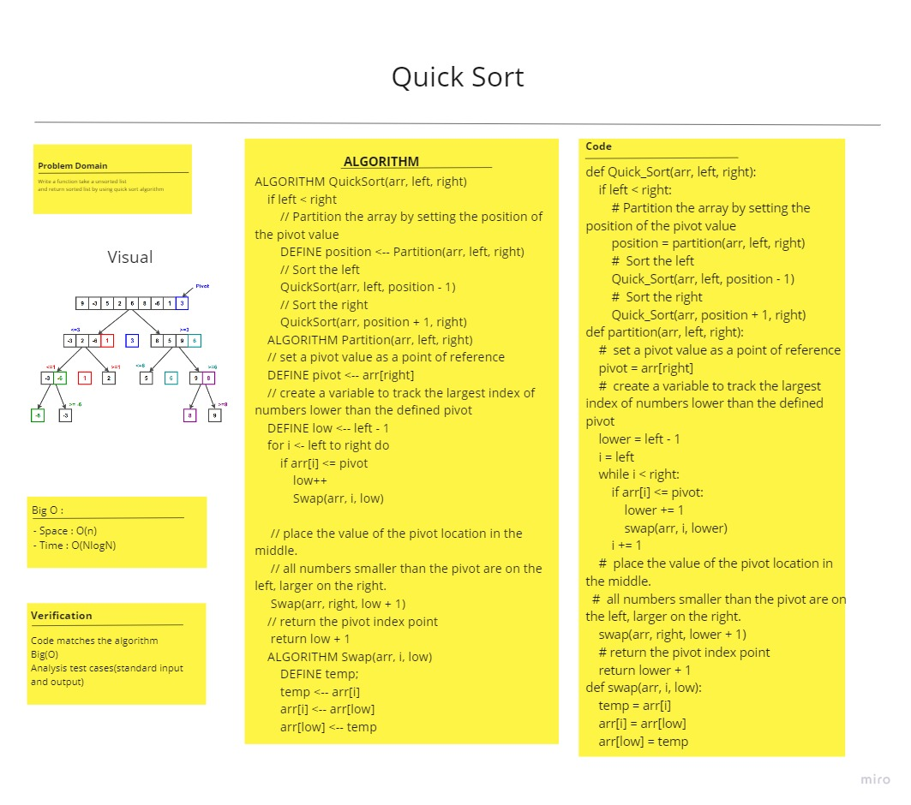

# Challenge Summary
<!-- Description of the challenge -->

## Whiteboard Process
<!-- Embedded whiteboard image -->

## Approach & Efficiency
<!-- What approach did you take? Why? What is the Big O space/time for this approach? -->
Space :
Time :
## Solution
<!-- Show how to run your code, and examples of it in action -->

## Unit Testing:
- [Unit tests](test_quick_sort.py)
