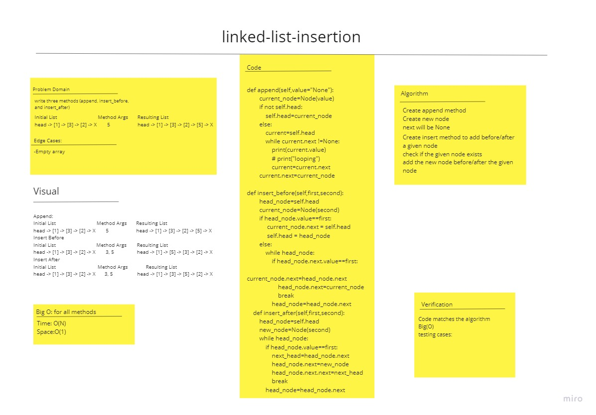

# Challenge Summary
<!-- Description of the challenge -->
Various insertion methods to an exisiting linked list

## Whiteboard Process
<!-- Embedded whiteboard image -->

## Approach & Efficiency
<!-- What approach did you take? Why? What is the Big O space/time for this approach? -->
Time:O(N)
Space:O(1)

## Solution
<!-- Show how to run your code, and examples of it in action -->
append

    adds a new node with the given value to the end of the list

insert before

    adds a new node with the given new value immediately before the first node that has the value specified

insert after

    adds a new node with the given new value immediately after the first node that has the value specified
