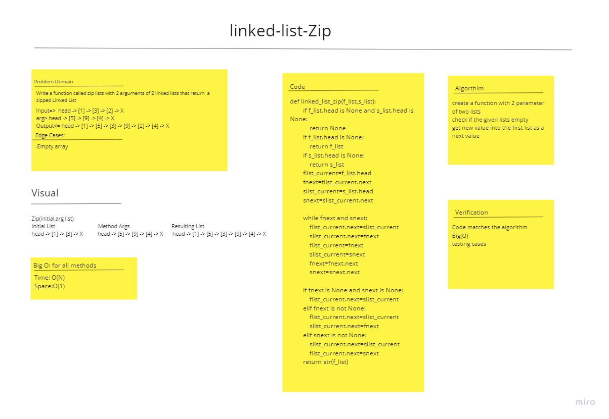

# Challenge Summary
<!-- Description of the challenge -->

Write a function called zip lists with 2 arguments of 2 linked lists that return a zipped Linked List

## Whiteboard Process
<!-- Embedded whiteboard image -->

## Approach & Efficiency
<!-- What approach did you take? Why? What is the Big O space/time for this approach? -->
Time: O(N)
Space: O(1)

## Solution
<!-- Show how to run your code, and examples of it in action -->
Zip two linked lists together into one so that the nodes alternate between the two lists and return a reference to the head of the zipped list.
