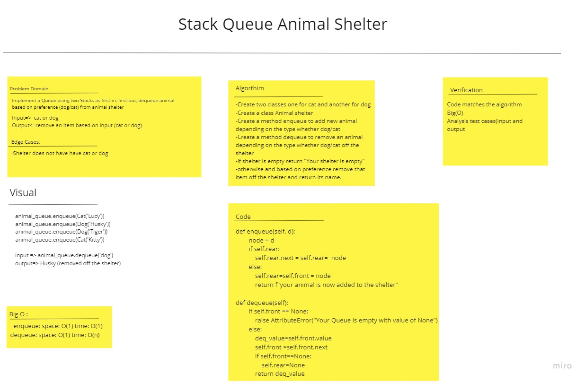

# Challenge Summary
<!-- Description of the challenge -->

Create a class AnimalShelter have dogs and cat, using FIFO approach, add cat or dog, remove either dog or cat based on prefernce.

## Whiteboard Process
<!-- Embedded whiteboard image -->

## Approach & Efficiency
<!-- What approach did you take? Why? What is the Big O space/time for this approach? -->
enqueue: space: O(1) time: O(1)
dequeue: space: O(1) time: O(n)

## Solution
<!-- Show how to run your code, and examples of it in action -->
using enqueue to add the animal (cat queue/dog queue).
using deqeueu method to remove (cat /dog).

    def enqueue(self, d):
        node = d
        if self.rear:
            self.rear.next = self.rear=  node
        else:
            self.rear=self.front = node
            return f"your animal is now added to the shelter"

    def dequeue(self):

        if self.front == None:
            raise AttributeError("Your Queue is empty with value of None")
        else:
            deq_value=self.front.value
            self.front =self.front.next
            if self.front==None:
                self.rear=None
            return deq_value

