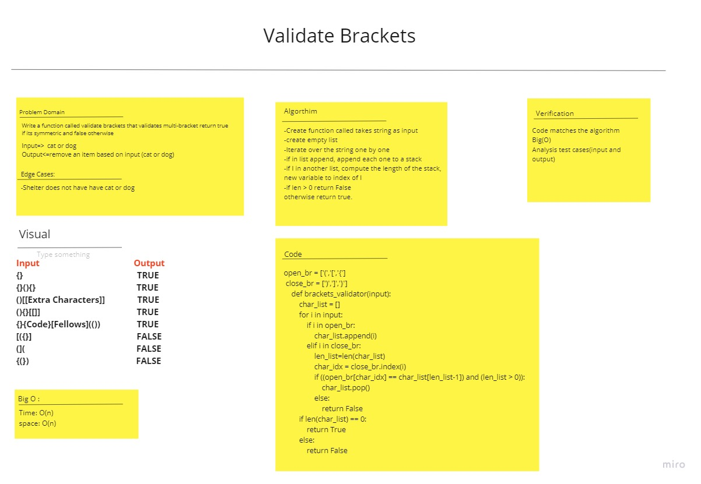

# Challenge Summary
<!-- Description of the challenge -->
Write a function called validate brackets that validates multi-bracket return true if its symmetric  and false otherwise

## Whiteboard Process
<!-- Embedded whiteboard image -->

## Approach & Efficiency
<!-- What approach did you take? Why? What is the Big O space/time for this approach? -->
Big O : Time: O(n) space: O(n)
## Solution
<!-- Show how to run your code, and examples of it in action -->

    open_br = ['(','[','{']
    close_br = [')',']','}']
    def brackets_validator(input):
        char_list = []
        for i in input:
            if i in open_br:
                char_list.append(i)
                # print("insdie my open bracket list",char_list)
            elif i in close_br:
                len_list=len(char_list)
                print(len_list)
                char_idx = close_br.index(i)
                if ((open_br[char_idx] == char_list[len_list-1]) and (len_list > 0)):
                    # print("inside second if :",len_list,char_list)
                    char_list.pop()
                else:
                    return False
        if len(char_list) == 0:
            return True
        else:
            return False
