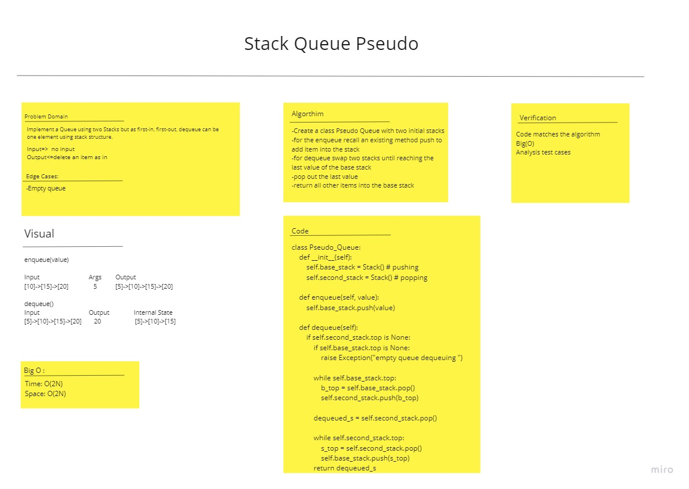

# Challenge Summary
<!-- Description of the challenge -->
Implement a Queue using two Stacks
Methods: enqueue and dequeue

## Whiteboard Process
<!-- Embedded whiteboard image -->

## Approach & Efficiency
<!-- What approach did you take? Why? What is the Big O space/time for this approach? -->
enqueue:

    space: O(1)
    time: O(1)

dequeue:

    space: O(2N)
    time: O(2N)

## Solution
<!-- Show how to run your code, and examples of it in action -->
    class Pseudo_Queue:
        def __init__(self):
            self.base_stack = Stack() # pushing
            self.second_stack = Stack() # popping

        def enqueue(self, value):
            self.base_stack.push(value)

        def dequeue(self):
            if self.second_stack.top is None:
                if self.base_stack.top is None:
                    raise Exception("empty queue dequeuing ")

                while self.base_stack.top:
                    b_top = self.base_stack.pop()
                    self.second_stack.push(b_top)

                dequeued_s = self.second_stack.pop()

                while self.second_stack.top:
                    s_top = self.second_stack.pop()
                    self.base_stack.push(s_top)
                return dequeued_s
