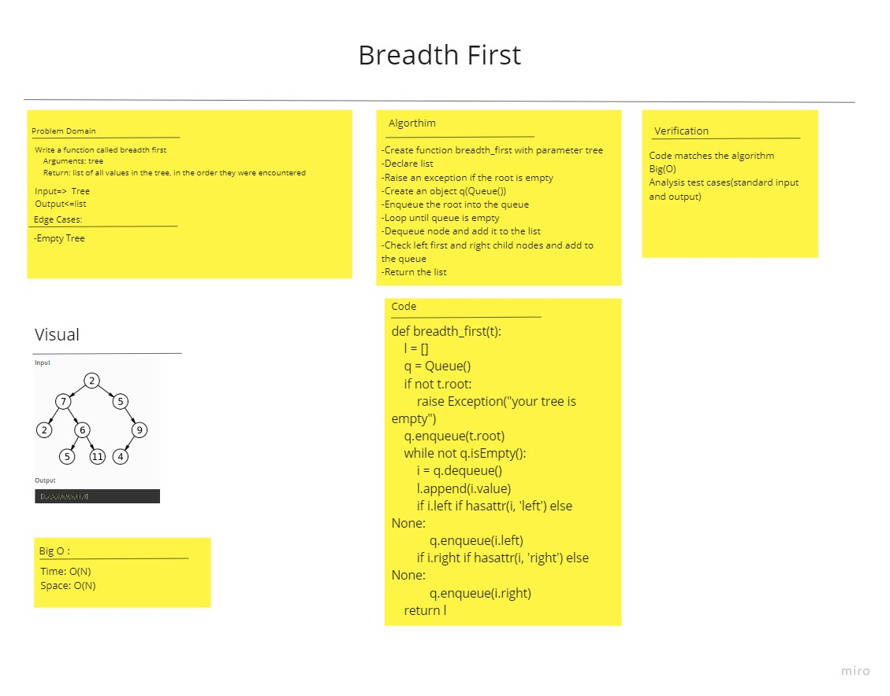

# Challenge Summary
<!-- Description of the challenge -->
Write a function called breadth first

    Arguments: tree
    Return: list of all values in the tree, in the order they were encountered

## Whiteboard Process
<!-- Embedded whiteboard image -->

## Approach & Efficiency
<!-- What approach did you take? Why? What is the Big O space/time for this approach? -->
Time: O(N)
Space: O(N)

## Solution
<!-- Show how to run your code, and examples of it in action -->

    def breadth_first(t):
    l = []
    q = Queue()
    if not t.root:
        raise Exception("your tree is empty")
    q.enqueue(t.root)
    while not q.isEmpty():
        i = q.dequeue()
        l.append(i.value)
        if i.left if hasattr(i, 'left') else None:
            q.enqueue(i.left)
        if i.right if hasattr(i, 'right') else None:
            q.enqueue(i.right)
    return l

# To check tests of this code Challenge
go to : 
python/tests/test_reverse_linked_list.py
