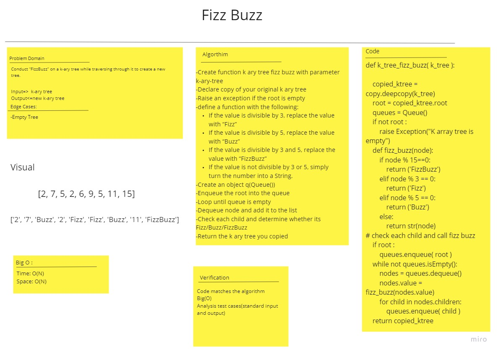

# Challenge Summary
<!-- Description of the challenge -->
Conduct “FizzBuzz” on a k-ary tree while traversing through it to create a new tree.
## Whiteboard Process
<!-- Embedded whiteboard image -->

## Approach & Efficiency
<!-- What approach did you take? Why? What is the Big O space/time for this approach? -->
 time: O(n) space: O(n)
## Solution
<!-- Show how to run your code, and examples of it in action -->
check all nodes and replace it by:
    -"Fizz" if divisible by 3.
    -"Buzz" if divisible by 5.
    -"FizzBuzz" if divisible by 3 and 5.
