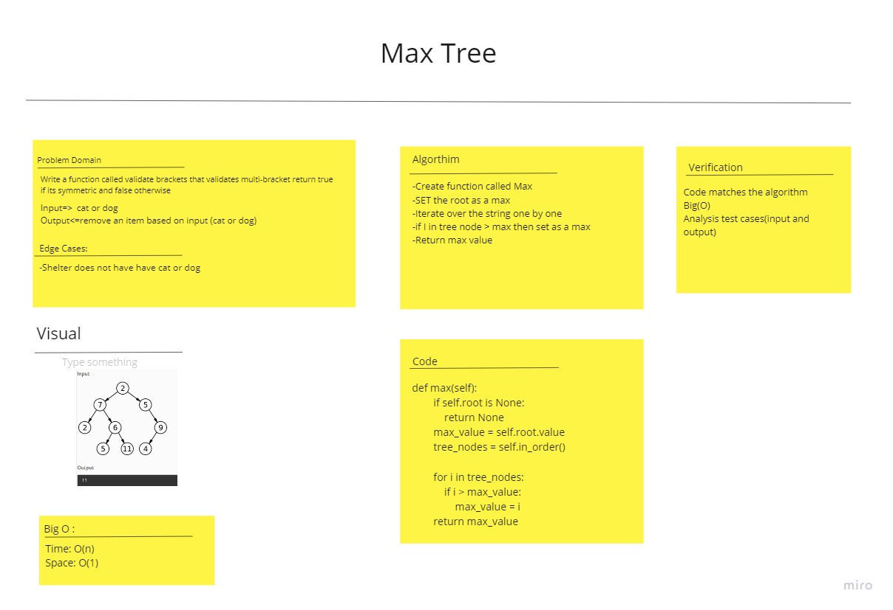

# Challenge Summary
<!-- Description of the challenge -->
Method for the Binary Tree class to find maximum value

## Whiteboard Process
<!-- Embedded whiteboard image -->

## Approach & Efficiency
<!-- What approach did you take? Why? What is the Big O space/time for this approach? -->
time: O(n) space: O(1)

## Solution
<!-- Show how to run your code, and examples of it in action -->
